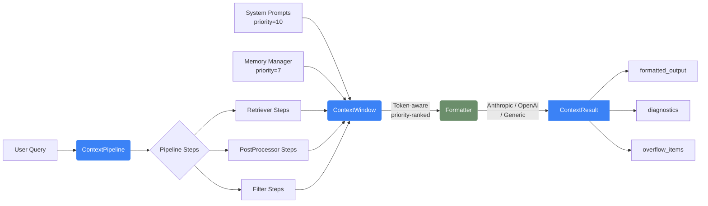

# anchor

### Context is the product. The LLM is just the consumer.

The Python toolkit for context engineering -- assemble RAG, memory, tools,
and system prompts into a single, token-aware pipeline.

[Get Started](getting-started/index.md)
[View on GitHub](https://github.com/artcgranja/anchor)

[](https://pypi.org/project/astro-anchor/)
[](https://pypi.org/project/astro-anchor/)
[](https://pypi.org/project/astro-anchor/)
[](https://github.com/artcgranja/anchor/blob/main/LICENSE)

---

## Why anchor?

Most AI frameworks focus on the LLM call. But the real challenge is assembling the
right **context** -- the system prompt, conversation memory, retrieved documents,
and tool outputs that the model actually sees.

anchor gives you a single, composable pipeline that manages all of it
within a strict token budget. No duct-taping RAG, memory, and tools together.
Build intelligent context pipelines in minutes.

---

## Features


-   **Hybrid RAG**

---

    Dense embeddings + BM25 sparse retrieval with Reciprocal Rank Fusion.
    Combine multiple retrieval strategies in a single pipeline for higher
    recall and precision.

    [Retrieval guide](guides/retrieval.md)

-   **Smart Memory**

---

    Token-aware sliding window with automatic eviction. Oldest turns are
    evicted when the conversation exceeds its budget -- recent context is
    never lost.

    [Memory guide](guides/memory.md)

-   **Token Budgets**

---

    Priority-ranked assembly fills from highest-priority items down.
    Per-source allocations let you reserve tokens for system prompts,
    memory, retrieval, and responses independently.

    [Token budgets](concepts/token-budgets.md)

-   **Provider Agnostic**

---

    Anthropic, OpenAI, or plain text. Format the assembled context for any
    LLM provider with a single method call. Swap providers without changing
    your pipeline.

    [Formatters guide](guides/formatters.md)

-   **Protocol-Based**

---

    Every extension point is defined as a PEP 544 structural protocol.
    Bring your own retriever, tokenizer, reranker, or memory store -- no
    base classes required.

    [Protocols](concepts/protocols.md)

-   **Type-Safe**

---

    All models are frozen Pydantic v2 dataclasses with full `py.typed`
    support. Catch integration errors at type-check time, not at runtime.

    [API reference](api/models.md)

-   **Agent Framework**

---

    Built-in tool registration, skills, and memory+RAG skills that give
    your agent long-term recall. Compose agents from the same pipeline
    primitives.

    [Agent guide](guides/agent.md)

-   **Full Observability**

---

    Tracing, metrics, cost tracking, and native OTLP export. Know exactly
    what your pipeline is doing, how long it takes, and what it costs.

    [Observability guide](guides/observability.md)


---

## Installation

**pip**

```bash
pip install astro-anchor
```

**uv**

```bash
uv add astro-anchor
```

**Extras**

```bash
pip install astro-anchor[bm25]   # BM25 sparse retrieval (rank-bm25)
pip install astro-anchor[cli]    # CLI tools (typer + rich)
pip install astro-anchor[all]    # Everything
```

---

## 30-Second Quickstart

Build your first context pipeline:

```python
from anchor import ContextPipeline, MemoryManager, AnthropicFormatter

pipeline = (
    ContextPipeline(max_tokens=8192)
    .with_memory(MemoryManager(conversation_tokens=4096))
    .with_formatter(AnthropicFormatter())
    .add_system_prompt("You are a helpful assistant.")
)

result = pipeline.build("What is context engineering?")
print(result.formatted_output)   # Ready for the Anthropic API
print(result.diagnostics)        # Token usage, timing, overflow info
```

:::tip[Plain strings just work]
`build()` accepts either a plain `str` or a `QueryBundle` object.
Plain strings are automatically wrapped in a `QueryBundle` for you.
:::

---

## How It Works



Every `ContextItem` carries a **priority** (1--10). When the total exceeds
`max_tokens`, the pipeline fills from highest priority down. Items that do not
fit are tracked in `result.overflow_items`.

---

## Comparison

| Feature | LangChain | LlamaIndex | mem0 | **anchor** |
|:--------|:---------:|:----------:|:----:|:-----------------:|
| Hybrid RAG (Dense + BM25 + RRF) |  partial |  yes |  no |  **yes** |
| Token-aware Memory |  partial |  no |  yes |  **yes** |
| Token Budget Management |  no |  no |  no |  **yes** |
| Provider-agnostic Formatting |  no |  no |  no |  **yes** |
| Protocol-based Plugins (PEP 544) |  no |  partial |  no |  **yes** |
| Zero-config Defaults |  no |  no |  yes |  **yes** |
| Built-in Agent Framework |  yes |  yes |  no |  **yes** |
| Native Observability (OTLP) |  partial |  partial |  no |  **yes** |

---

## Token Budgets

For fine-grained control over how tokens are allocated across sources,
use the preset budget factories:

```python
from anchor import ContextPipeline, default_chat_budget

budget = default_chat_budget(max_tokens=8192)
pipeline = ContextPipeline(max_tokens=8192).with_budget(budget)
```

Three presets are available:

| Preset | Best for | Conversation | Retrieval | Response |
|:-------|:---------|:------------:|:---------:|:--------:|
| `default_chat_budget` | Conversational apps | 60% | 15% | 15% |
| `default_rag_budget` | RAG-heavy apps | 25% | 40% | 15% |
| `default_agent_budget` | Agentic apps | 30% | 25% | 15% |

:::note
Each budget automatically reserves 15% of tokens for the LLM response.
Per-source overflow strategies (`"truncate"` or `"drop"`) control what
happens when a source exceeds its cap.
:::

---

## Decorator API

Register pipeline steps with decorators instead of factory functions:

```python
from anchor import ContextPipeline, ContextItem, QueryBundle

pipeline = ContextPipeline(max_tokens=8192)

@pipeline.step
def boost_recent(items: list[ContextItem], query: QueryBundle) -> list[ContextItem]:
    """Boost the score of recent items."""
    return [
        item.model_copy(update={"score": min(1.0, item.score * 1.5)})
        if item.metadata.get("recent")
        else item
        for item in items
    ]

result = pipeline.build("What is context engineering?")
```

:::tip
Use `@pipeline.async_step` for async functions and call `abuild()`
instead of `build()`.
:::

---

## Next Steps


-   **Getting Started**

---

    Installation, first pipeline, and all the basics.

    [Get started](getting-started/index.md)

-   **Core Concepts**

---

    Context engineering, architecture, protocols, and token budgets.

    [Concepts](concepts/index.md)

-   **Guides**

---

    Pipeline, retrieval, memory, agents, observability, and more.

    [Guides](guides/index.md)

-   **API Reference**

---

    Full API documentation for every module.

    [API docs](api/index.md)


